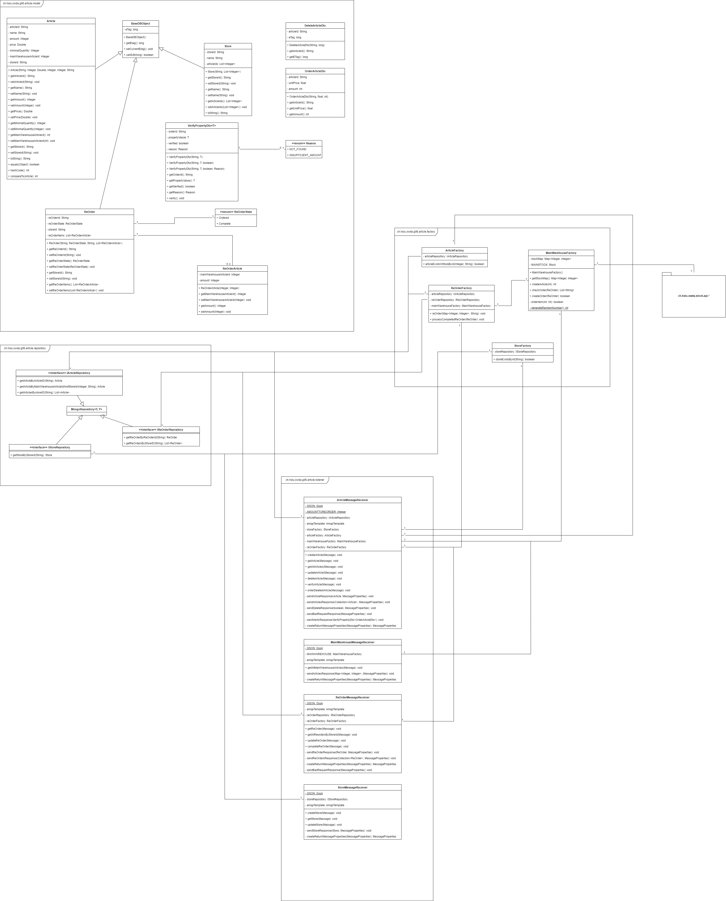

= SWAT FS24 - Articleservice
Livio, Theiler <livio.theiler@stud.hslu.ch>
V0.0.1, 2024-05-09
:toc:
:toc-title: Inhaltsverzeichnis
:toclevels: 1

== Einführung
Das Projekt ist ein Artikel-Service, der in Java und Spring Boot entwickelt wurde.
Es verwendet Maven als Build-Tool und ist für die Integration mit MongoDB und RabbitMQ konfiguriert.

Der Service ist dafür verantwortlich, Artikelinformationen zu verwalten und bereitzustellen. Es bietet eine Reihe von Endpunkten, um Artikel zu erstellen, abzurufen, zu aktualisieren und zu löschen.

== Klassendiagramm

image::HSLU-Logo-21-klein.png[]